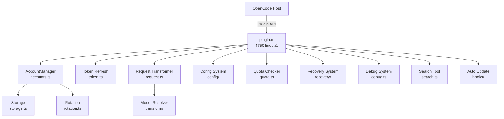

# opencode-ag-auth — Codebase Analysis & Optimization Insights

## 📖 Project Overview

**opencode-ag-auth** is an OpenCode plugin providing Google Antigravity IDE OAuth authentication with multi-account rotation, quota management, and intelligent request proxy. It supports both Antigravity and Gemini CLI routing for Gemini/Claude models.

### Architecture at a Glance



### Key Stats

| Metric | Value |
|--------|-------|
| Source files (non-test) | ~57 |
| Test files | ~35 |
| Main plugin file | **4,750 lines** ⚠️ |
| Request handler | ~1,900 lines |
| Account manager | ~1,513 lines |
| Storage (with migrations) | ~795 lines |
| Config schema | ~525 lines |

---

## 🚨 Critical Issues

### 1. **God File: [plugin.ts](file:///home/kocomon/Project/opencode-ag-auth/src/plugin.ts) is 4,750 lines**

> [!CAUTION]
> This is the single biggest code quality problem. [plugin.ts](file:///home/kocomon/Project/opencode-ag-auth/src/plugin.ts) handles OAuth flow, account management orchestration, rate limiting, endpoint fallback, verification probes, warmup, toast notifications, error handling, and the main request proxy loop — all in one file.

**Impact:**
- Extremely hard to understand, review, or debug
- High risk of regressions when modifying any feature
- Impossible to test individual concerns in isolation
- `while(true)` request loop at ~L1883 spans ~1,500 lines with nested [for](file:///home/kocomon/Project/opencode-ag-auth/src/plugin.ts#3583-3600) loops

**Recommendation:** Extract into focused modules:
```
plugin/
├── orchestrator.ts        # Main fetch proxy loop
├── rate-limit-handler.ts  # 429/503/529 handling + backoff
├── verification.ts        # Account verification probe
├── oauth-flow.ts          # Login/callback flow
├── warmup.ts              # Thinking warmup logic
├── toast-manager.ts       # Toast deduplication + scope
├── session-tracker.ts     # Child/parent session tracking
└── index.ts               # Wire everything together
```

### 2. ~~**Duplicated [fetchWithTimeout](file:///home/kocomon/Project/opencode-ag-auth/src/antigravity/oauth.ts#122-135) implementations**~~ ✅ FIXED

> [!NOTE]
> **Fixed:** Extracted into shared [http.ts](file:///home/kocomon/Project/opencode-ag-auth/src/plugin/http.ts). Both `oauth.ts` and `quota.ts` now import from the single source.

### 3. **Client Secrets Hardcoded in Source**

> [!WARNING]
> OAuth client secrets are hardcoded in [constants.ts](file:///home/kocomon/Project/opencode-ag-auth/src/constants.ts#L4-L9):
> ```
> ANTIGRAVITY_CLIENT_SECRET = "GOCSPX-..."
> GEMINI_CLI_CLIENT_SECRET = "GOCSPX-..."
> ```
> These are committed to git and published to npm. While Google's OAuth for installed apps does not consider the client secret truly secret, this is still a security smell and makes rotation impossible without a code release.

### 4. ~~**Synchronous `require()` in ESM Module**~~ ✅ FIXED

> [!NOTE]
> **Fixed:** `isWSL()`/`isWSL2()` moved to [environment.ts](file:///home/kocomon/Project/opencode-ag-auth/src/plugin/environment.ts) which uses proper ESM `import { readFileSync } from "node:fs"`.

---

## 🔧 Optimization Opportunities

### 5. ~~**[isWSL()](file:///home/kocomon/Project/opencode-ag-auth/src/plugin.ts#268-278) and [isWSL2()](file:///home/kocomon/Project/opencode-ag-auth/src/plugin.ts#279-289) read [/proc/version](file:///proc/version) every call**~~ ✅ FIXED

> [!NOTE]
> **Fixed:** Moved to [environment.ts](file:///home/kocomon/Project/opencode-ag-auth/src/plugin/environment.ts) with module-level caching. `/proc/version` is read once at load. Also deduplicated the `isWSL()` copy that existed in `server.ts`.

### 6. ~~**Unbounded growth of module-level Maps/Sets**~~ ✅ FIXED

> [!NOTE]
> **Fixed:** Added `cleanupStaleTrackingState()` in `plugin.ts` that evicts stale entries from `rateLimitStateByAccountQuota` (when size > 200) and `accountFailureState` (always). Runs at the top of each request loop iteration.

| Structure | Location | Status |
|-----------|----------|--------|
| `warmupAttemptedSessionIds` | plugin.ts:L125 | Bounded at 1000, OK ✅ |
| `rateLimitToastCooldowns` | plugin.ts:L138 | Cleaned at 100 ✅ |
| `rateLimitStateByAccountQuota` | plugin.ts:L1300 | **Now cleaned** ✅ |
| `emptyResponseAttempts` | plugin.ts:L1303 | Cleaned per-request ✅ |
| `accountFailureState` | plugin.ts:L1393 | **Now cleaned** ✅ |
| `quotaRefreshInProgressByEmail` | plugin.ts:L178 | Cleaned on completion ✅ |

### 7. **Redundant account snapshot creation**

`accountManager.getAccountsSnapshot()` (called in debug logging at L2032) does a deep clone of all accounts including spreading `parts` and `rateLimitResetTimes`. Under heavy concurrent usage, this is wasteful.

**Fix:** Only snapshot when debug is actually enabled (check `isDebugEnabled()` before calling).

### 8. **[loadAccounts()](file:///home/kocomon/Project/opencode-ag-auth/src/plugin/storage.ts#591-694) overwrites storage on every migration**

In [storage.ts:L591-693](file:///home/kocomon/Project/opencode-ag-auth/src/plugin/storage.ts#L591-L693), loading accounts triggers a [saveAccounts()](file:///home/kocomon/Project/opencode-ag-auth/src/plugin/storage.ts#695-722) call when migration happens. But [loadAccounts()](file:///home/kocomon/Project/opencode-ag-auth/src/plugin/storage.ts#591-694) is called from [loadAccountsUnsafe()](file:///home/kocomon/Project/opencode-ag-auth/src/plugin/storage.ts#752-783) which is called from [saveAccounts()](file:///home/kocomon/Project/opencode-ag-auth/src/plugin/storage.ts#695-722) itself — creating a potential recursive call if the file needs migrating during a save.

**Fix:** Separate the migration logic from the read path. Only trigger migration explicitly on startup, not on every load.

### 9. **Sequential quota checks**

In [quota.ts:L332](file:///home/kocomon/Project/opencode-ag-auth/src/plugin/quota.ts#L332), accounts are checked sequentially:
```typescript
for (const [index, account] of accounts.entries()) {
  // ... token refresh + API call per account
}
```

**Fix:** Use `Promise.allSettled()` to check all accounts in parallel (each already has its own token), respecting a concurrency limit:
```typescript
const results = await Promise.allSettled(
  accounts.map(account => checkSingleAccountQuota(account, client, providerId))
);
```

### 10. **[extractVerificationErrorDetails()](file:///home/kocomon/Project/opencode-ag-auth/src/plugin.ts#402-563) is over-engineered**

This 160-line function ([plugin.ts:L402-562](file:///home/kocomon/Project/opencode-ag-auth/src/plugin.ts#L402-L562)) walks arbitrary JSON structures recursively to find verification URLs. It parses SSE `data:` lines, decodes escaped text, and handles multiple encoding formats.

While thorough, the recursive [walk()](file:///home/kocomon/Project/opencode-ag-auth/src/plugin.ts#455-503) with `visited` set is complex. Consider simplifying with a focused parser that handles the known Google error response shapes, rather than walking arbitrary objects.

---

## 🏗️ Architecture Improvements

### 11. **Introduce a proper state machine for request lifecycle**

The request retry loop in [plugin.ts](file:///home/kocomon/Project/opencode-ag-auth/src/plugin.ts) (L1883-3200+) uses a `while(true)` with multiple `continue` and `break` statements, nested [for](file:///home/kocomon/Project/opencode-ag-auth/src/plugin.ts#3583-3600) loops with `i -= 1` tricks, and multiple `shouldSwitchAccount` flags. This is a state machine implemented implicitly.

**Fix:** Extract an explicit state machine:
```typescript
type RequestState = 
  | { type: 'select-account' }
  | { type: 'try-endpoint', accountIndex: number, endpointIndex: number }
  | { type: 'rate-limited', backoffMs: number }
  | { type: 'switch-account' }
  | { type: 'done', response: Response }
  | { type: 'error', error: Error };
```

### 12. **Consolidate header style resolution**

Header style logic is scattered across:
- [resolveHeaderRoutingDecision()](file:///home/kocomon/Project/opencode-ag-auth/src/plugin.ts#4680-4699) in plugin.ts
- `resolveModelForHeaderStyle()` in model-resolver.ts
- [getRandomizedHeaders()](file:///home/kocomon/Project/opencode-ag-auth/src/constants.ts#175-190) in constants.ts
- [getSoftQuotaThresholdForHeaderStyle()](file:///home/kocomon/Project/opencode-ag-auth/src/plugin.ts#4700-4709) in plugin.ts
- [headerStyleToQuotaKey()](file:///home/kocomon/Project/opencode-ag-auth/src/plugin.ts#1384-1391) in plugin.ts

This should be a single `HeaderRouter` class with clear, testable routing rules.

### 13. **Storage version migrations are linear chains**

v1 → v2 → v3 → v4 migration chain in [storage.ts](file:///home/kocomon/Project/opencode-ag-auth/src/plugin/storage.ts) means every future version adds another function. Each intermediate migration creates throwaway objects.

**Fix:** Migrate directly from any version to latest:
```typescript
function migrateToLatest(data: AnyAccountStorage): AccountStorageV4 {
  // Direct migration from any version to V4
}
```

### 14. **[AccountManager](file:///home/kocomon/Project/opencode-ag-auth/src/plugin/accounts.ts#392-1513) is doing too much**

The [AccountManager](file:///home/kocomon/Project/opencode-ag-auth/src/plugin/accounts.ts#392-1513) class (~1,500 lines) handles:
- Account CRUD
- Authentication state
- Rate limit tracking
- Soft quota checks
- Fingerprint management
- Verification status
- LRU/hybrid/round-robin selection
- Disk persistence

**Recommendation:** Split into:
- `AccountStore` — CRUD + persistence
- `RateLimitTracker` — cooldowns, rate limit state
- `AccountSelector` — strategy-based selection logic
- `FingerprintManager` — fingerprint lifecycle

### 15. **Add integration test for the full request proxy loop**

There's no test for the main `while(true)` fetch proxy loop. This is the most critical code path in the entire project — the one that handles rate limits, endpoint fallbacks, account rotation, and response transformation.

---

## 📋 Quick Wins Summary

| Priority | Issue | Effort | Impact | Status |
|----------|-------|--------|--------|--------|
| 🔴 High | Split [plugin.ts](file:///home/kocomon/Project/opencode-ag-auth/src/plugin.ts) into focused modules | Large | Maintainability | ⬜ TODO |
| ~~🔴 High~~ | ~~Extract duplicated fetchWithTimeout~~ | ~~Small~~ | ~~DRY~~ | ✅ Done |
| ~~🟡 Medium~~ | ~~Cache isWSL() result~~ | ~~Small~~ | ~~Performance~~ | ✅ Done |
| ~~🟡 Medium~~ | ~~Fix `require()` in ESM~~ | ~~Small~~ | ~~Compatibility~~ | ✅ Done |
| 🟡 Medium | Parallel quota checks | Medium | Latency | ⬜ TODO |
| ~~🟡 Medium~~ | ~~Add cleanup for unbounded Maps~~ | ~~Small~~ | ~~Memory safety~~ | ✅ Done |
| 🟢 Low | State machine for request loop | Large | Readability | ⬜ TODO |
| 🟢 Low | Direct storage migration | Medium | Simplicity | ⬜ TODO |
| 🟢 Low | Split [AccountManager](file:///home/kocomon/Project/opencode-ag-auth/src/plugin/accounts.ts#392-1513) | Large | Testability | ⬜ TODO |

---

## 🎯 What's Done Well

- **Comprehensive config schema** with Zod validation and clear defaults
- **Robust rate limiting** with per-account, per-model-family, per-header-style tracking
- **Good test coverage** (~35 test files covering individual modules)
- **Smart quota fallback** between Antigravity and Gemini CLI quotas
- **Health score system** for account selection (well-designed state tracking)
- **Token bucket** for client-side rate limiting
- **Proper file locking** via `proper-lockfile` for concurrent access
- **Atomic writes** with temp files and rename for storage
- **Proactive token refresh** in the background
- **Auto-update checker** hook
